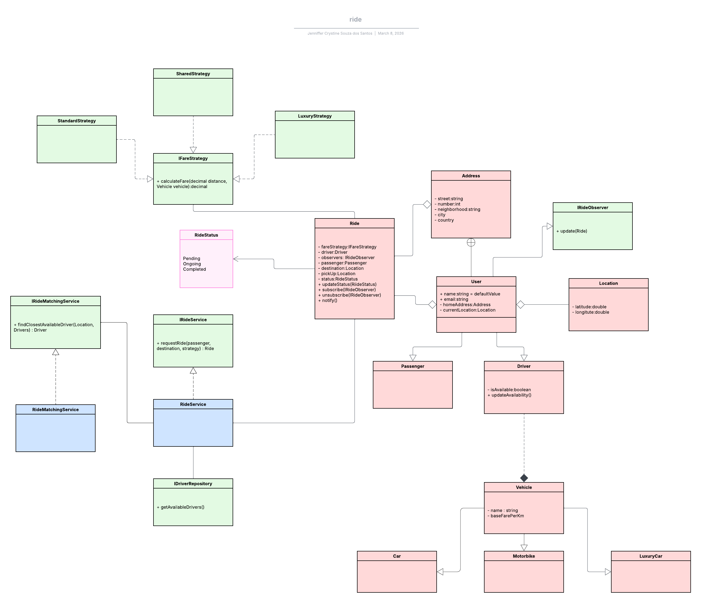

# Ride Sharing System Design

This project implements a simplified ride-sharing application inspired by systems like Uber.

Passengers can request rides, drivers are matched based on proximity, and the system calculates fares using different pricing strategies.

The goal of this project is to demonstrate clean architecture, SOLID principles, and the use of design patterns.

## Functional Requirements

- Passengers can request rides.
- The system assigns the nearest available driver.
- Different vehicle types are supported.
- Multiple fare calculation strategies are available.
- Both passengers and drivers receive ride status notifications.

## Design Patterns

### Strategy Pattern
Used to implement multiple fare calculation strategies.

Examples:
- StandardFareStrategy
- SharedFareStrategy
- LuxuryFareStrategy

### Observer Pattern
Used to notify passengers and drivers when ride status changes.

Observers:
- Passenger
- Driver

Subject:
- Ride

### Service Layer
RideService coordinates the process of requesting rides and assigning drivers.

### Matching Service
RideMatchingService is responsible for selecting the nearest available driver.

## SOLID Principles

### Single Responsibility Principle
Each class has a clear responsibility:
- Ride handles ride state and notifications.
- RideMatchingService handles driver matching.
- Fare strategies handle fare calculations.

### Open/Closed Principle
New fare strategies or vehicle types can be added without modifying existing code.

### Dependency Inversion
High-level services depend on abstractions like IFareStrategy and IRideMatchingService.

## System Design

Class diagram showing relationships between Ride, RideMatchingService, RideService, IFareStrategy implementations, Observer pattern components for Passenger and Driver, and vehicle type hierarchy:

## Possible Improvements

- Driver location updates via GPS
- Distance calculation using map APIs
- Support for surge pricing
- Event-driven notifications
- Persistence layer for rides and drivers